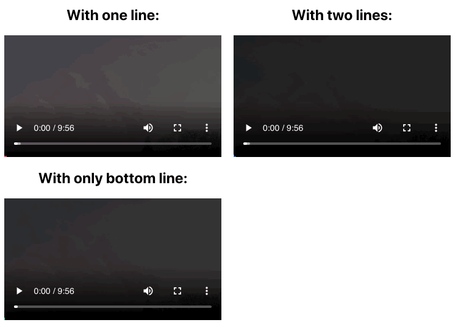

# react-video-progress

> React component to show video progress at frame border

[](https://www.npmjs.com/package/react-video-progress) [](https://standardjs.com) [](https://travis-ci.org/asashay/react-video-progress) [](https://coveralls.io/github/asashay/react-video-progress?branch=master)

## Demo


[More samples](https://asashay.github.io/react-video-progress/)

## Install

```bash
npm install --save react-video-progress
```

## Usage

It takes in all the `<video>` props and passes them down to the underlying video tag.

```tsx
import React, { Component } from 'react'

import VideoProgress from 'react-video-progress'

class Example extends Component {
  render() {
    return <VideoProgress
      progressStart="BottomLeft"
      type="TwoLines"
      pathColor="red"
      pathWidth="7px"
      src='http://commondatastorage.googleapis.com/gtv-videos-bucket/sample/BigBuckBunny.mp4'
      height="200px"
      controls
      />
  }
}
```

## Props
| Prop | Type | Default | Required |
|---|---|---|---|
| pathColor | string | `red` | No |
| pathWidth | string | `5px` | No |
| progressStart | one of [`BottomLeft`, `TopLeft`, `TopRight`, `BottomRight`] | `BottomLeft` | No |
| type | one of [`OneLine`, `TwoLines`] | `OneLine` | No |
| wrapperStyle | inline styles for wrapper (e.g. `color, width` etc) |  | No |
| wrapperClassName | string | `''` | No |
| ...rest | any of `React.HTMLProps<HTMLVideoElement>` (e.g. `height, className` etc) |  | No |

## License

MIT © [asashay](https://github.com/asashay)
